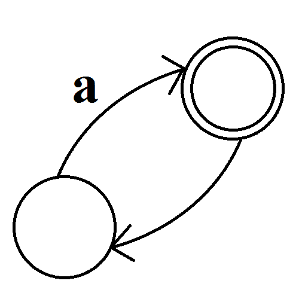

<!-- start project-info -->
<!--
project_title: API Finit Automaton
github_project: https://github.com/manudiv16/API-Finit-Automaton
license: MIT
icon: /home/manu/PycharmProjects/Finit_Automat/doc/Thompson-kleene-star.svg
homepage: https://github.com/manudiv16/API-Finit-Automaton
Docker:https://n
license-badge: False
contributors-badge: True
lastcommit-badge: True
codefactor-badge: True
--->

<!-- end project-info -->

<!-- start badges -->


<!-- end badges -->

<!-- start description -->
# Welcome to Finit Automat

Flask tool that manages the behavior of a finite automata.
Generate photos of the automata through calls to the api 
with a json that describes the automata

<!-- end description -->

<!-- start prerequisites -->
## Prerequisites

pip install -r requirements.txt

install Graphviz
> https://graphviz.org/download/

<!-- end prerequisites -->

<!-- start installing -->


<!-- end installing -->

<!-- start using -->
## How generate json of automaton

Json describes finit automaton
```json
{
    "deterministic":true,
    "alphabet": [
      "a",
      "b"
    ],
    "states": [
      {
        "state": 0,
        "final": false,
        "start": true,
        "morphs": {
          "a": 1,
          "b": 2
        }
      },
      {
        "state": 1,
        "final": false,
        "start": false,
        "morphs": {
          "a": 3,
          "b": 5
        }
      }
    ]
  }
```

<!-- end using -->

<!-- start contributing -->


<!-- end contributing -->

<!-- start contributors -->


<!-- end contributors -->

<!-- start table-contributors -->
## contributors 
<table id="contributors">
	<tr id="info_avatar">
		<td id="manudiv16" align="center">
			<a href="https://github.com/manudiv16">
				
			</a>
		</td>
	</tr>
	<tr id="info_name">
		<td id="manudiv16" align="center">
			<a href="https://github.com/manudiv16">
				<strong>Fran Martin</strong>
			</a>
		</td>
	</tr>
	<tr id="info_commit">
		<td id="manudiv16" align="center">
			<a href="/commits?author=manudiv16">
				<span id="role">💻</span>
			</a>
		</td>
	</tr>
</table>
<!-- end table-contributors -->
